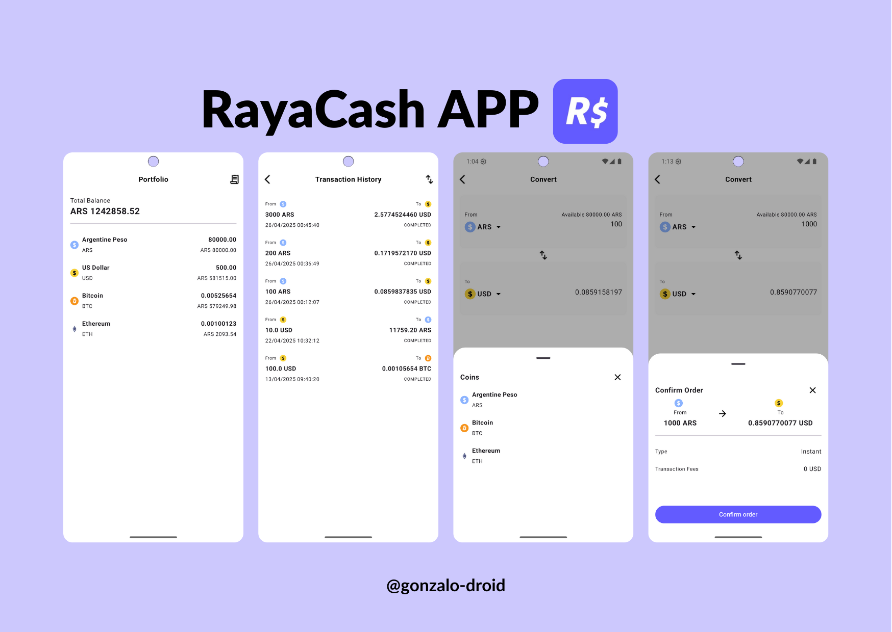

<h1 align="center">CixCash App</h1>

<p align="center">
  <a href="https://spdx.org/licenses/MIT.html"></a>
  <a href="https://android-arsenal.com/api?level=24"></a><br>
  <a href="https://www.youtube.com/@GonzaloDroid2050"></a> 
</p>

<p align="center">  
CixCash es una aplicación móvil de conversión de criptomonedas y gestión de transacciones, desarrollada con Kotlin Multiplatform (Android/iOS).  
Permite consultar precios actualizados, convertir entre monedas y registrar transacciones fácilmente.
</p>

<p align="center">

</p>

## CixCash App
CixCash es una aplicación de conversión de criptomonedas y divisas. Desarrollada en [Kotlin Multiplatform](https://www.jetbrains.com/help/kotlin-multiplatform-dev/get-started.html) para Android/iOS. Permite registrar transacciones, visualizar balances convertidos a pesos argentinos (ARS), y realizar conversiones entre monedas como USD, BTC y ETH.


## Features
- Consulta de tasas de cambio actualizadas (USD, BTC, ETH, ARS).
- Conversión de montos entre monedas
- Soporte multiplataforma (Android e iOS).
- Visualización de transacciones de converción recientes
- Cálculo del balance total en ARS
- Theme Oscuro y Claro
- Manejo de estados con `StateFlow`
- UI moderna con `Jetpack Compose` y `Material3`
- Arquitectura limpia con `MVVM`

## Tech Stack
- **SDK minSdk:** 24.  
- **SDK targetSdk:** 35.  
- **Kotlin Multiplatform (KMP)** Reutilización de lógica de negocio en Android e iOS [Kotlin KMP](https://kotlinlang.org/lp/multiplatform/)  -
- **Ktor** Cliente HTTP asíncrono multiplataforma para realizar llamadas a APIs [Ktor](https://ktor.io/)
- **Koin** Inyección de dependencias liviana y flexible [Koin](https://insert-koin.io/)                          
- **Material3** Implementación del sistema de diseño Material Design actualizado [Material3](https://m3.material.io/) 
- Basado en [Kotlin](https://kotlinlang.org/), utilizando [Coroutines](https://github.com/Kotlin/kotlinx.coroutines) + [Flow](https://kotlin.github.io/kotlinx.coroutines/kotlinx-coroutines-core/kotlinx.coroutines.flow/) para operaciones asíncronas.  
- **Jetpack Compose:** Kit de herramientas moderno de Android para desarrollo de UI declarativa.  
- **Lifecycle:** Observa los ciclos de vida de Android y gestiona los estados de UI ante cambios de ciclo de vida.  
- **ViewModel:** Administra datos relacionados con la UI y es consciente del ciclo de vida, asegurando la persistencia de datos tras cambios de configuración.  
- **Navigation:** Facilita la navegación entre pantallas, complementado con [Hilt Navigation Compose](https://developer.android.com/jetpack/compose/libraries#hilt) para inyección de dependencias.  
- **Room:** Permite construir una base de datos con una capa de abstracción sobre SQLite para un acceso eficiente a los datos.  
- **Arquitectura MVVM (View - ViewModel - Model):** Promueve la separación de responsabilidades y mejora el mantenimiento del código.  
- **Patrón Repository:** Actúa como mediador entre diferentes fuentes de datos y la lógica de negocio de la aplicación.  
- **[Kotlin Serialization](https://github.com/Kotlin/kotlinx.serialization):** Serialización sin reflejos para múltiples plataformas y formatos en Kotlin.  
- **[ksp](https://github.com/google/ksp):** API de procesamiento de símbolos en Kotlin para generación y análisis de código.  


## Architecture
**CixCash App**  sigue el patrón de arquitectura MVVM (Model-View-ViewModel) y se estructura en capas bien definidas para garantizar el mantenimiento, escalabilidad y separación de responsabilidades:
[Guía oficl de arquitectura de Google](https://developer.android.com/topic/architecture).

Model View ViewModel (MVVM)
- `Model`: Repositorios, acceso a la base de datos (Room), y clientes de red (Ktor)
- `ViewModel`: Lógica de presentación, manejo de estados con `StateFlow`
- `View`: Composables que representan la UI, observan el estado y reaccionan a eventos

Layer : Presentation, Domain, Data. 

- `Presentation`: Maneja todo lo relacionado a la interfaz de usuario (UI), estados (State), eventos (Event) y ViewModels.
- `Domain`: Contiene los modelos de negocio (model) y los casos de uso (usecase) que definen la lógica de la aplicación de forma independiente a cualquier framework o librería.
- `Data`: Implementa la lógica de acceso a datos, ya sea local (Room Database) o remoto (API con Ktor). Está dividida en repository, local y remote.
Esta organización sigue las buenas prácticas de arquitectura limpia (Clean Architecture) adaptadas al contexto de aplicaciones móviles.

## Project Structure

```plaintext
CixCash/
├── androidMain/               # Código específico de Android
│   ├── data/database          # Inicialización Room de Android
│   └── di/                    # Inyección de dependencias para Android
│   └── shared/                # Clases aplicadas solo para Android (Toast, BigDecimal, DateUtil)
├── commonTest/                # Módulo testing (Casos de uso)
├── commonMain/                # Módulo multiplataforma (Kotlin común)
│   ├── data/
│   │   ├── database/          # Database, DAOS y Entities
│   │   ├── remote/            # Ktor Client para APIs, ApiService
│   ├── di/                    # Inyección de dependencias común (Koin)
│   ├── domain/
│   │   ├── model/             # Entidades y modelos de negocio
│   │   ├── usecase/           # Casos de uso de la aplicación
│   └── shared/                # Expect functions para Android/iOS
│   ├── ui/
│   │   ├── core/              # Componentes, navegación y funciones de extensión
│   │   ├── convert/           # Scree, ViewModel, State, Action y Event, conversión de monedas
│   │   ├── home/              # Scree, ViewModel y State, mi portafolio
│   │   ├── transacion/        # Scree, Viewmodel y State, para mostras las transacciones
├── iosMain/                   # Código específico de iOS 
│   ├── data/database          # Inicialización Room de iOS
│   └── di/                    # Inyección de dependencias para iOS
│   └── shared/                # Clases aplicadas solo para iOS (Toast, NSDecimalNumber, DateUtil)
├── build.gradle.kts           # Configuración de composeApp
```
#### /shared representa las clases que se adaptaron segun la plataforma (andoird/ios)

- KMMDateUtil : obtener la fecha actual, así actualizar la fecha en las transacciones
- KMMDecimal: Al trabajar con monedas el control de los decimales es importante, considerando que son criptomonedas que limitado a un máximo de 10 decimales para esos caso. Además para garantizar exactitud he aplicado BigDecimal (Android) y NSDecimalNumber[iOS]
- KMMToast: El Toast que estamos acostumbrados en Android, no es compatible con KMM así que adapte la funcionalidad según la plataforma


## Instalación y Configuración  

##### 1️⃣ Clone Repository
```bash
git clone https://github.com/gonzalo-droid/CixCashApp
```
##### 2️⃣ Generar tu Clave de API_KEYen Coingecko
- Visita https://docs.coingecko.com/v3.0.1/reference/introduction
- Regístrate o inicia sesión.
- Dirígete a la sección API de tu cuenta y genera una nueva clave de API
##### 3️⃣ API_KEY en /commonMain/di/DataModule.kt
```bash
const val COIN_GECKO_API_KEY = "TU_API_KEY"
const val API_HOST = "api.coingecko.com"
const val API_KEY = "x-cg-demo-api-key"
```
##### 4️⃣ Compilar y Ejecutar el Proyecto
- Usa Gradle para compilar y ejecutar el proyecto:
```bash
./gradlew run
```
Para Android, abre el proyecto en Android Studio y ejecuta la aplicación desde allí. 

** Recuerda que para iOS necesitas una mac y así emular en un iphone


## 🚀 ¡Contribuciones bienvenidas!  

💡 **Si quieres proponer mejoras o corregir errores:**  
1. Haz un *fork* del repositorio.  
2. Crea una rama con tu mejora.
  ```bash
   git checkout -b feature/your-feature-name
  ```
3. Realiza los cambios y haz un *commit*.
 ```bash
   git commit -am 'Add some feature'
   ```  
4. Sube los cambios a tu repositorio.
 ```bash
   git push origin feature/your-feature-name
   ```  
5. Abre un *Pull Request* para revisión.  


## Sigamos en contacto

✨ **Espero que este proyecto te sea útil para seguir aprendiendo.**  
💡 ¡Puedes colaborar en mejoras del proyecto dejando un *Pull Request*!  
⭐ Además, agradecería mucho que le dieras una estrella al proyecto 🤩 


Aún estoy definiendo el formato 🫠, pero lo importante es empezar. 
¡Suscríbete y vamos a codear!
- [YouTube](https://www.youtube.com/@GonzaloDroid2050)
- [TikTok](https://www.tiktok.com/@gonzalodroid)
- [LinkedIn](https://www.linkedin.com/in/gonzalo-lozg/)
- [Github](https://github.com/gonzalo-droid)


## 🚧 Próximas mejoras

- [ ] Soporte para autenticación, Google Auth
- [ ] Listar todas la monedas disponibles
- [ ] Filtros en las transacciones
- [ ] Gráficas Traker

## License
This project is licensed under the **MIT License**. See the [LICENSE](LICENSE) file for details.
